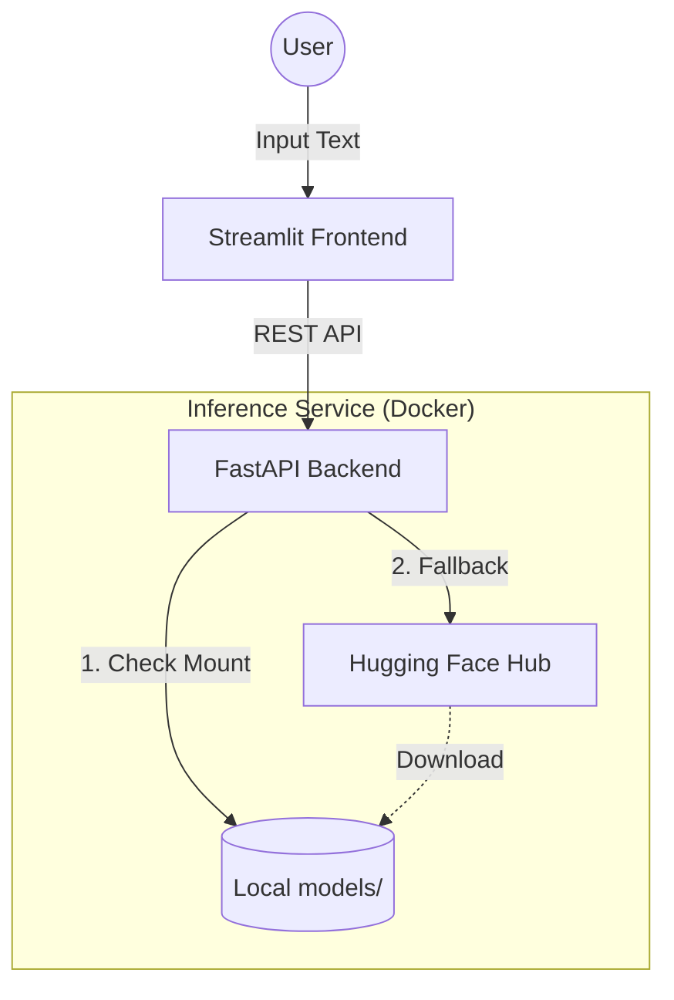

# 🌍 Polyglot NER Explorer

[](https://www.python.org/downloads/)
[](https://fastapi.tiangolo.com/)
[](https://streamlit.io/)
[](https://www.docker.com/)

A production-grade Multilingual Named Entity Recognition (NER) system designed to extract entities from **Hungarian** and **German** text. This project demonstrates a full machine learning lifecycle, from fine-tuning an XLM-RoBERTa model to deploying it via a containerized FastAPI backend and a Streamlit frontend.

---

## 🏗️ System Architecture

The project implements a **Hub-First, Local-Override** strategy. The app works instantly by pulling from the Hugging Face Hub, but automatically switches to using your local `models/` folder if it detects you have run a training session.



---

## 🚀 Key Features

- **Zero-Setup Deployment**: Run `docker-compose up` and the system pulls the latest production-ready weights from the Hub automatically.
- **Local-Override Support**: If you run `train.py`, the backend detects the new `config.json` in your local folder and prioritizes your custom results.
- **Multilingual Support**: Fine-tuned XLM-RoBERTa base model specifically optimized for Hungarian and German.
- **Production API**: FastAPI avec documentation automatique (Swagger) and healthchecks for service reliability.
- **Interactive UI**: Streamlit-based explorer with real-time entity highlighting and performance metrics.
- **Modern Tooling**:
  - `uv`: For extremely fast dependency management.
  - `Docker Compose`: One-command orchestration for the entire stack.
  - `W&B`: Comprehensive experiment tracking and metric visualization.

---

## 📊 Model Performance

Evaluated on a combined test set of Hungarian and German datasets:

| Metric | Score |
| :--- | :--- |
| **Overall F1-Score** | **90.99%** |
| Overall Precision | 90.00% |
| Overall Recall | 92.00% |
| Overall Accuracy | 99.06% |

### Entity-Specific F1 Scores:
- **PER (Person)**: 93.05%
- **LOC (Location)**: 90.98%
- **ORG (Organization)**: 89.90%
- **MISC (Miscellaneous)**: 88.31%

---

## ⚙️ Getting Started

### Using Docker (Recommended)
The easiest way to get the project running is using Docker Compose. This starts both the API and the UI automatically.

```bash
docker-compose up --build
```
- **UI**: [http://localhost:8501](http://localhost:8501)
- **API Docs**: [http://localhost:8000/docs](http://localhost:8000/docs)

### Local Development
1. **Install Dependencies**:
   ```bash
   uv sync
   ```
2. **Start Backend**:
   ```bash
   uv run python app.py
   ```
3. **Start Frontend**:
   ```bash
   uv run streamlit run streamlit_app.py
   ```

---

## 📂 Project Structure

```text
├── src/
│   ├── config.py          # Centralized configuration (Dyanmic Repo IDs)
│   ├── predictor.py       # Inference logic with Hub fallback
│   ├── trainer.py         # HF Trainer wrapper with Auto-Push to Hub
│   └── data_loader.py     # Multilingual data pipeline
├── app.py                 # FastAPI Entry Point
├── streamlit_app.py       # Streamlit Frontend
├── Dockerfile.api         # Backend Container Definition
├── Dockerfile.streamlit   # Frontend Container Definition
└── docker-compose.yml     # Service Orchestration
```

---

## 🛠️ Advanced Usage

### Custom Training
To train the model with your own repository settings:
```bash
uv run python train.py --hub_repo_id your-username/your-repo --epochs 5
```
This will automatically track the run on W&B and push the finalized model to the Hub.

---
*Developed as a demonstration of production ML engineering practices.*
