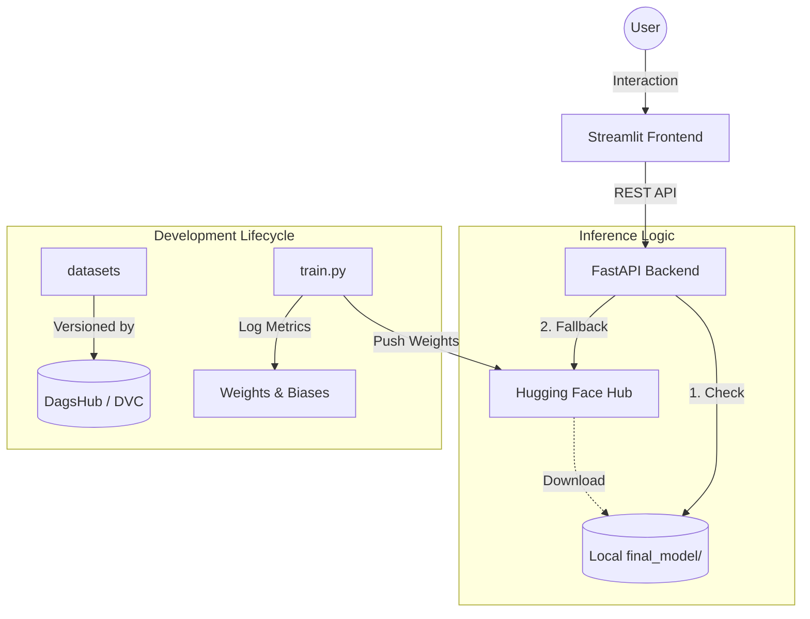

# 🌍 Polyglot NER Explorer: Production-Grade Multilingual Named Entity Recognition

[](https://www.python.org/downloads/)
[](https://fastapi.tiangolo.com/)
[](https://streamlit.io/)
[](https://www.docker.com/)
[](https://wandb.ai/polyglot-ner-project)
[](https://dagshub.com/RichardHolzhofer/Polyglot-NER-project)
[](https://pytorch.org/)

A high-performance Multilingual NER system optimized for **CPU-only inference** in Hungarian and German. This project features a minimalist, production-ready stack designed for low-footprint cloud deployments and generic hardware stability.

---

## 🏗️ System Architecture & Lifecycle

The project follows a modern MLOps lifecycle. We use **DVC** for data versioning, **W&B** for experiment tracking, and a dynamic inference bridge that prioritizes local fine-tuned weights while falling back to the cloud for zero-config startups.



---

## 🛠️ The Tech Stack

| Category | Tools Used |
| :--- | :--- |
| **Model Architecture** | [XLM-RoBERTa](https://huggingface.co/facebook/xlm-roberta-base) (Transformer-based, 270M parameters) |
| **Frameworks** | Hugging Face `transformers`, `datasets`, `evaluate`, `seqeval` |
| **Tracking & Versioning** | [Weights & Biases](https://wandb.ai/) (W&B), [DagsHub](https://dagshub.com/) + [DVC](https://dvc.org/) |
| **API Layer** | FastAPI with Pydantic validation & Uvicorn |
| **Frontend UI** | Streamlit (Interactive visualization & testing) |
| **Environment** | [uv](https://github.com/astral-sh/uv) (CPU-only optimized environment) |
| **Deployment** | Docker & Docker Compose (Multi-stage builds) |
| **CI/CD** | GitHub Actions (Ruff + Pytest) |

---

## 📊 Model Performance

Our model achieves state-of-the-art results for the targeted language pair, evaluated on a combined test set of Hungarian (SzegedNER) and German (GermEval) datasets.

### 📈 Overall Metrics
- **F1-Score (Combined)**: **90.04%**
- **Hungarian F1**: 95.29%
- **German F1**: 87.58%
- **Accuracy**: 99.01%

### 🏷️ Entity-Specific F1 Scores (Combined)
| Entity | F1-Score | Precision | Recall |
| :--- | :--- | :--- | :--- |
| **PER (Person)** | **93.22%** | 93.07% | 93.36% |
| **LOC (Location)** | **90.38%** | 90.67% | 90.08% |
| **ORG (Organization)** | **87.71%** | 86.87% | 88.56% |
| **MISC (Misc)** | **80.12%** | 77.40% | 83.03% |

> [!TIP]
> Full experiment logs, including learning rate curves and per-epoch metrics, are available on [Weights & Biases here](https://wandb.ai/polyglot-ner-project).

---

## ☁️ Deployment & Stability ("CPU First")

1.  **CPU Optimization**: The project uses **PyTorch +CPU** builds. This eliminates the "no kernel image" errors common on mismatched GPU architectures and stabilizes inference across all cloud providers.
2.  **Minimal Docker Footprint**: Removing NVIDIA/CUDA libraries reduced the Docker image size from ~5.5GB to **~1.5GB**, enabling faster container pulls and cheaper hosting.
3.  **Hub Fallback**: Training remains computationally expensive. The system defaults to local weights (`final_model/`) but pulls the pre-trained weights from the [Hugging Face Hub](https://huggingface.co/RichardHolzhofer/xlm-roberta-ner-hun-ger) if needed.
4.  **GPU Training**: To re-enable GPU for `train.py`, simply update the `uv` index in `pyproject.toml` to a CUDA-compatible builds (e.g., `cu124`).

---

## 🚀 Setting Up

### 1. Data & Model Access (Optional)
The project defaults to a **Hub-First** strategy—inference works out-of-the-box by pulling the latest weights from the Hugging Face Hub. 

Manual setup is only required if you want to use a local model mirror or inspect the datasets:
1.  **Add DagsHub Remote**:
    ```bash
    uv run dvc remote add -d origin https://dagshub.com/RichardHolzhofer/Polyglot-NER-project.dvc
    ```
2.  **Pull Artifacts**:
    ```bash
    uv run dvc pull -r origin final_model data
    ```
    *This will populate the `data/` and `final_model/` folders for local-override support.*

### 2. Run via Docker (Zero-Setup)
The simplest way to start the entire stack.
```bash
docker-compose up
```
*(Note: Use `docker-compose up --build` if you have made structural changes to the source code or Dockerfiles).*

### 3. Local Terminal Setup
1.  **Sync Environment**:
    ```bash
    uv sync --all-groups
    ```
2.  **Start Services**:
    - **API**: `uv run python app.py`
    - **UI**: `uv run streamlit run streamlit_app.py`

---

## 🛠️ Advanced Usage: Custom Training

### Prerequisites
Before running a training session, you must configure your environment to ensure the model is tracked and pushed correctly:
1.  **Environment Variables**: Create a `.env` file from the [template](.env.example).
2.  **Set `HUB_REPO_ID`**: Update this to your own Hugging Face repository name (e.g., `username/repo-name`).
3.  **W&B Tracking**: Ensure `WANDB_API_KEY` is set for live experiment logging.

### Execution
```bash
# Start a new training run
uv run python train.py --run_name "my_ner_v1" --epochs 10 --lr 3e-5
```

### Argument Reference
| Flag | Description | Default |
| :--- | :--- | :--- |
| `--run_name` | The identity of the run on W&B and local filename. | `xlm-roberta-ner-hun-ger` |
| `--epochs` | Total training iterations over the dataset. | `5` |
| `--lr` | Peak learning rate for the Cosine scheduler. | `1e-5` |
| `--batch_size` | Training batch size for each GPU/CPU. | `96` |

---

## 📂 Project Structure

```text
├── .github/workflows/      # CI/CD pipelines (Ruff, Pytest)
├── src/                    # Core source code
│   ├── __init__.py         # Package initialization
│   ├── config.py           # Dependency-injected project settings
│   ├── data_loader.py      # Multilingual dataset loading logic
│   ├── data_preprocessor.py # Data cleaning and harmonization
│   ├── exception.py        # Standardized error handling
│   ├── logger.py           # Centralized logging configuration
│   ├── predictor.py        # CPU-optimized inference logic
│   └── trainer.py          # Hugging Face Trainer wrapper
├── tests/                  # Automated verification suite
│   ├── __init__.py
│   ├── conftest.py         # Pytest fixtures and settings
│   ├── test_app.py         # API endpoint validation
│   ├── test_data_loader.py # Data loading unit tests
│   ├── test_data_preprocessor.py # Preprocessing logic tests
│   └── test_predictor.py   # Inference accuracy tests
├── data/                   # Versioned data (managed by DVC)
├── notebooks/              # Experimental analysis & notebooks
├── logs/                   # Training/Evaluation logs
├── app.py                  # API entry point & model orchestration
├── streamlit_app.py        # Interactive Explorer UI
├── Dockerfile.api          # Backend API image definition
├── Dockerfile.streamlit    # Frontend UI image definition
├── docker-compose.yml      # Multi-service orchestration
├── pyproject.toml          # UV-based dependency requirements
├── uv.lock                 # Deterministic dependency lockfile
├── .env.example            # Environment variable template
├── .dockerignore           # Optimized build exclusion list
└── LICENSE                 # Project MIT License
```

---
*Developed by Richard Holzhofer. For full transparency, visit the [DagsHub Project Page](https://dagshub.com/RichardHolzhofer/Polyglot-NER-project).*
